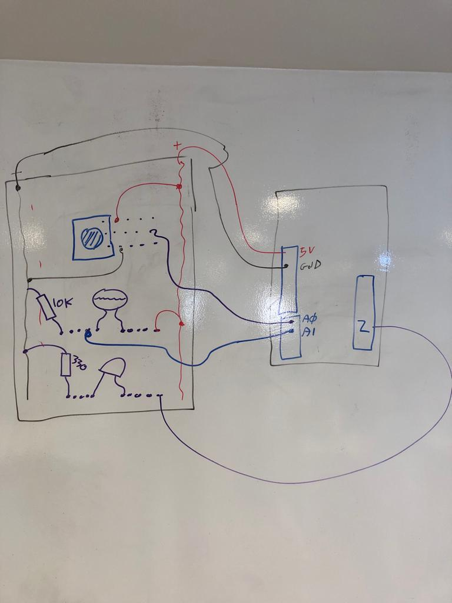

## New York University Abu Dhabi    
## Interactive Media Program    
## Course title: Interactive Media in the World
Course number: IM-UH 1114J  
Section: 1    
Credit Hours: 4         
Prerequisites: None       

Shortcut to [today's lecture](lectureNotes.md/#todays-lecture)  

Course website: [https://github.com/michaelshiloh/IMInTheWorld](https://github.com/michaelshiloh/IMInTheWorld)      

Instructor: Michael Shiloh mshiloh@nyu.edu    
Office hours: By appointment  
Meeting times: Varies, see the [Schedule](schedule.md)  
Session: J-term June 2023  

**Everything here is subject to change due to health regulations, logistics, etc.**

## Monday May 29
### Introduction to Arduino

- IDE
- `blink`
- What role does Arduino play?
- Switches and other sensors
- LEDs and other actuators
- Inputs and outputs
- Electricity
- Circuits
- Schematics
- Series and Parallel

Make sure everything is working

- Upload the Blink example
- Change the parameter in delay()
- Upload again and verify that the LED blinks at the new rate

#### Basic Arduino and Digital Output

Upload File -> Examples -> Basic -> Blink example

Let's extend this circuit to the breadboard:

The most confusing part of this lecture will be the solderless breadboard:

Image courtesy of
[SparkFun](https://learn.sparkfun.com/tutorials/how-to-use-a-breadboard/all)


Review

- Code
- Circuit
- Input and Output (I/O) pins
	- 20 IO pins
	- All 20 pins can do digital input and digital output
	- Many of the pins have additional special functionality
- Built-in LED
	- On the Arduino Uno this LED is on pin 13
	- On the Arduino Uno LED_BUILTIN = 13 

#### Analogue Input

Build this circuit. Try to follow the schematic and not the breadboard view:


- Analogue Inputs, `analogRead()`, and (some) sensors go together
	- This only works on the six analog input pins (A0-A5)
	- Digital sensors, like a switch, have only one of two values 
	and so are more suited to a digital input
- Remember that the so-called analog input pins can do digital input and
	output as well
- Since you have so few analog input pins, when you decide which pins to use
	for which device, reserve the analog input pins for analog input devices
	as much as possible

#### Analogue Output

- Analogue Outputs, `analogWrite()`, PWM and (some) actuators go together
	- `analogWrite()` only works on the six PWM pins (3, 5, 6, 9, 10, and 11).
	- LEDs, motors, and some other actuators respond properly to PWM
	- Other actuators, like a solenoid, do not respond well to PWM and really
		should be considered digital actuators
	- Since you have so few analog outputs, when you decide which pins to use
		for which device, reserve the analog output pins for analog output devices
		as much as possible

- Not true analog voltage. PWM = Pulse Width Modulation
- Works for LEDs and motors

#### Functions that you know from p5.js which are useful here:
- `map()`
- `constrain()`
- `if()`

Remember how we used `print()` in p5.js to help us find problems in our 
program? You can do that in Arduino to but the function has a slightly
different name: `Serial.println()`
- Must be initialized `Serial.begin()`
- Can not concatenate strings with the `+` function
	- Instead, you need multiple calls to `Serial.print()` e.g.:

````
Serial.print("First value = ");
Serial.print(firstValue);
Serial.print(" Second value = ");
Serial.print(secondValue);
Serial.println();
````

Example using an analog input to control the brightness of an LED

````
const int LED_PIN = 3;           // the PWM pin the LED is attached to
const int POT_PIN = A2;
int brightness = 0;    // how bright the LED is

// the setup routine runs once when you press reset:
void setup() {
  // declare pin 9 to be an output:
  pinMode(LED_PIN, OUTPUT);
  Serial.begin(9600);
}

// the loop routine runs over and over again forever:
void loop() {
  int pot_value = analogRead(POT_PIN); // 0-1023
  brightness = map(pot_value, 0, 1023, 255, 0);
  Serial.println(brightness);
  analogWrite(LED_PIN, brightness); // 0-255
}
````
#### Digital Input

Adding a switch


````
void setup() {
  pinMode(8, OUTPUT);
  pinMode(13, OUTPUT);
  pinMode(A2, INPUT);
}

void loop() {

  int switchPosition = digitalRead(A2);

  if (switchPosition == HIGH) {
    digitalWrite(8, HIGH);   // turn the LED on (HIGH is the voltage level)
    digitalWrite(13, LOW);
  } else  {
    digitalWrite(8, LOW);    // turn the LED off by making the voltage LOW
    digitalWrite(13, HIGH);
  }
}
````

An example:

````

const int pushButton = A2;
const int redLEDPin = A0;
const int greenLEDPin = 8;

void setup() {
  pinMode(redLEDPin, OUTPUT);
  pinMode(greenLEDPin, OUTPUT);
}

void loop() {

  int buttonState = digitalRead(pushButton);

  if (buttonState == HIGH) {
    digitalWrite(redLEDPin, HIGH);
    digitalWrite(greenLEDPin, HIGH);
    delay(500);
    digitalWrite(greenLEDPin, LOW);
    delay(300);
    digitalWrite(redLEDPin, LOW);
    digitalWrite(greenLEDPin, HIGH);
    delay(700);
  }
  allOff();
  delay(1000);
}

void allOff() {
  digitalWrite(redLEDPin, LOW);
  digitalWrite(greenLEDPin, LOW);
}
````

Other things you can do:

Add another LED on a different pin


Add another switch on a different pin


#### In-class exercise

Now write a program that will blink different patterns depending on which
switch is pressed. 
Using two switches you can select between four patterns.
How is that possible?

Do you see a similarity between this circuit and 
something we learned earlier?

Some analogue sensors are resistive, some are not. 
Resistive sensors all use the same
pattern: a voltage divider.
Note the similarity to the circuit we used for a switch.
The switch circuit is also effectively a voltage divider, one that has only
two values instead of an infinite range of values

What other sensors do we have in the kit?

Which ones are resistive?

#### Potentiometer

[Here](https://learn.sparkfun.com/tutorials/sparkfun-inventors-kit-experiment-guide---v41/circuit-1b-potentiometer)

#### Misc
- Hand drawn schematics in your homework are fine!
Here is an example:


- Hand drawn switches can use the simple symbol
- Resources are available to help you with homework (me, Jack), but only
	if you start your homework early enough. If you wait until the last minute
	and then don't have time to get help, that is unexcusable.
- Use constants for pin numbers

#### In-class exercise

1. Use one of the analogue sensors to select which of two LEDs lights up
1. Use one of the analogue sensor to control how fast two LEDs alternate
1. Use a momentary switch (often called a *pushbutton* or a *button* in the
	 Arduino literature) to select a different range for mapping an analog
	 sensor to an analog output device
1. Use a potentiometer to select from 4 different behaviors of a circuit
1. Use a momentary switch to enter a mode where the minimum and maximum values
	from the LDR are stored. When the switch is released, use those values to
	map the range of values from the LDR to the full range of the LED brightness

#### Sound

**`tone()`**

- [Schematic](https://www.arduino.cc/en/Tutorial/ToneMelody)
- Before you try that code, just try 
`tone(spkrPin, 440);`
and
`tone(spkrPin, 440, 1000);`
- [Reference
page](https://www.arduino.cc/reference/en/language/functions/advanced-io/tone/)

**Notes**
- "Use of the `tone()` function will interfere with PWM output on pins 3 and 11"
	- The word "intefere" is rather vague. 
	I think they mean that it 
	prevents `analogWrite()` from working on pins 3 and 11
- The `tone()` function is *non-blocking*
- Arduino supports tabs 
- Arduino has arrays 
- What is resistor for? 
	- LED needs a resistor to limit current so it doesn't burn out
	- LDR needs a resistor to form a voltage divider
	- Piezo buzzer neither burns out nor needs a voltage divider
	- So why a resistor?

#### Servo motor

- [Schematic](https://www.arduino.cc/en/Tutorial/Knob)
- [Reference
page](https://www.arduino.cc/en/Reference/Servo)


**Notes**
- Use of the servo library disables `analogWrite()` (PWM) on pins 9 and 10
- The `Servo.write()` function is *non-blocking*

#### More about PWM
- How do you suppose `analogWrite()` makes an LED dimmer?
- [PWM](https://www.ekwb.com/blog/what-is-pwm-and-how-does-it-work/)
- What do `analogWrite()`, `tone()` and `Servo` have in common?
- What is sound?
- How does a servo motor
	[work](https://lastminuteengineers.com/servo-motor-arduino-tutorial/)?

**Notes**
1. You may have noticed that the built-in LED blinks 3 times when you turn on
	 your Arduino. In fact it does this every time it resets, which also happens
	 when you upload a new program. Since this LED is connected directly to pin
	 13, it means that whatever you have attached to pin 13 will be activated 3
	 times briefly whenver the Arduino resets. So, if you make a big robot, 
	 you probably should not use pin 13 for the motor
1. Pins 0 and 1 are used for communication with your laptop, and this has two
	 effects:
	1. Connecting anything to pins 0 or 1 might interfere with laptop
		 communication (which includes uploading!)
	2. Anything connected to pins 0 or 1 might be activated during
		 communication!
1. For these reasons it is best to avoid pins 0, 1, and 13. If you run out of
	 pins and need to use them there are ways around this.


### Processing

#### Simple shapes

- `ellipse()`
- `rect()`
- `size()`
- `triangle(x1, y1, x2, y2, x3, y3)`
- `line()`
- `point()`

What does this all mean?
- Functions
- Arguments or parameters

Controlling color, fill, and stroke

- `color()`
- `stroke()`
- `noStroke()`
- `fill()`
- `arc(100, 100, 100, 100, 0, 180)`
- `arc(100, 100, 100, 100, 0, PI, CHORD)`
- `random()`

Confused? 
- Google
- Processing reference page

#### Variables
- `int myNumber = 45;`
- `int myRandomNumber = random(255);`
- `int myRandomNumber = round(random(255));`
- Other variable types. `int` is by far most common, another common is `float`
- Built-in variables
	- `width`, `height`
	- many others

Here is an example Processing program (also called a 'sketch') 

````
size(400, 400);
ellipse(width/2, height/2, 50, 50);

stroke(0,255,0);
fill(255,0,0);
//ellipse(100,100, 50, 50);

fill(255,0,0, 30);
//rect(30, 30, 50, 80);


// Now I will try to draw an arc
//arc(100, 100, 100, 100, 0, radians(180), CHORD);

// pick a random number up to 180
float myRandomArcSize = random(180);
int arcSizeAsInt = round (myRandomArcSize);
println(myRandomArcSize + "   " + arcSizeAsInt);

// convert that number to radians
float arcSizeInRadians = radians(myRandomArcSize);

print(myRandomArcSize + "    " + arcSizeInRadians);

// draw the arc
arc(100, 100, 100, 100, 0, arcSizeInRadians, CHORD);
````

#### Animation
- `draw()`
- `setup()`

Basic concept:
- `setup()`, `draw()`

````
int foo = 0;

void setup() {
  size(300, 300);
}

void draw() {
  ellipse(foo, 50, 40, 40);
  foo = foo + 1;
}
````
**Indentation**
-	COMMAND T or CONTROL T is your friend!

What is this `int foo` stuff?

#### Variables!

`background()`

`frameRate()`

What is this `void blahblah()` stuff?

#### Functions!

- `stroke()`, `fill()`, `ellipse()`, and `rect()` are all built-in functions
meaning they are defined for you
- Other  functions you have to define yourself (e.g. `setup()` and `draw()`
- Later we will talk about what the word `void` means and how to define
	functions

#### Interaction with Processing

- conditionals

````
void setup() {
  size(300, 300);
}

void draw() {
  if (mousePressed == true) {
    background(color(0, 0, 255));
  } else {
    background(color(200, 0, 0));
  }
}
````

**Important concepts**:
1. `mousePressed` is another built-in variable. There are many others.
1. `mousePressed` is a new type of data, namely a `boolean`, which means it has
	 only one of two values, `true` or `false`
1. Note that `{` and `}` indicate the blocks
1. **The `else` part of an `if()` statement is optional (what happens if we remove it?)**

-  Another two interesting built-in variables: `mouseX`, `mouseY`
	- Using the cursor to draw
	- Determining where the mouse is
	- Determining whether the mouse is inside a box or a circle
	- Now use a mouse click to clear the screen
	- (Time permitting, primitive painting program)

More examples:

````
 /*
  print("the value of the variable mouseX ");
  print(mouseX);
  print(" Y ");
  print (mouseY);
  println();
  */
  println("X= " + mouseX + " Y= " + mouseY + "frameCount = " + frameCount);
````

````
void draw() {
  ellipse(50, 70, 30, 30);
  
  /* this only works for a rectangle
  if ((mouseX > 50) && (mouseX < 75) && mouseY > 70 && mouseY < 105) {
    print("mouse is in the box! ");
  }
  */
  if (dist(mouseX, mouseY, 50, 70) < 15) {
    print("mouse is in the circle! ");
  }
 
  println("X= " + mouseX + " Y= " + mouseY + "frameCount = " + frameCount);
}
````

#### Loops
`while()` is like `if()` but it 
**keeps on doing it as long as condition is true**

````
void setup() {
  size(300, 300);

  int foo = 50; // Initialization step

  while (foo < width) { // while() construct and condition
    ellipse(foo, 50, 40, 40);
    foo = foo + 50; // Incrementation step
  }
}
````

Important things to note:

1. You should get in the habit of giving meaningful names to your variables. 
1.1. What is a better name for the variable foo?
1. What would happen if you replace the `while()` with `if()`?

There is another way to make a loop using the keyword `for()`. The `for()`
loop structure combines the initialization step and the incrementation step
into the `for()` loop construction:

````
void setup() {
  size(300, 300);

	// initialization, condition, and incrementation all in one line
  for (int foo = 50; foo < width; foo = foo + 50)  { 
    ellipse(foo, 50, 40, 40);
  }
}
````

Which should you use? Whichever is easier for you to understand. Remember that
most of the time spent programming is fixing problems, and whatever you
understand best will probably have fewer problems.

#### Functions

Every time you use one of the built-in 'commands', you are really using (or
more properly 'calling') a built-in function. Functions are a very important
building block of programming, and in addition to using built-in functions,
you can also create your own. In fact, you've already been doing that, when
you created the `setup()` and `draw()` functions. In the case of
`setup()` and `draw()` you have to use those names, but when you create other
functions you can make up your own names. Just like variables names, good 
function names make your programs easier to understand.

Why create your own functions?

- Reuse (if it's something you might do again)
- Clarity (remember your three important audiences: yourself, others learning
	from you, me when I grade your work)
- Easier to debug (what is debugging?)
	- One of the most powerful ways to approach
	a bug is to reproduce it with simplest possible example. 
	This is much easier when the thing that's causing
	the problem is already a function.
- Modularity
- Flexibility (with good choice of parameters)

Let's modify the example from last week to use a function. First let's draw a
house instead of a circle to make it a little more interesting:

````
void setup() {
  size(300, 300);

  // initialization, condition, and incrementation all in one line
  for (int foo = 50; foo < width; foo = foo + 50)  {
    rect(foo, 50, 40, 40);
    line(foo, 50, foo+20, 30);
    line(foo+20, 30, foo+40, 50);
  }
}
````

Now let's make a function called `drawOneHouse()`. If we want to
draw a house at different locations, we need a way to tell
the function `drawOneHouse()` where to put the house. Functions accommodate
this by allowing us to pass information into the function by putting 
that information in the parenthesis. In the function, we store this
information in temporary variables that we can use in the function:

````
void setup() {
  size(300, 300);

  for (int foo = 50; foo < width; foo = foo + 50) {
    drawOneHouseAt(foo);
  }
}

void drawOneHouseAt(int x) {
  rect(x, 50, 40, 40);
  line(x, 50, x+20, 30);
  line(x+20, 30, x+40, 50);
}
````

**Things to notice**
1. I've said this before and I'll keep saying: 
	**Choose descriptive names for your variables and functions!** 
	`foo` is a bad name, `x` is a good name,
	 `drawOneHouseAt` is a good name.
1. The value of `foo` (50, 100, 150 ...) is the information passed to the
	 function so that the function can do it's work. The proper name for this
	 information is an **argument**
1. The variable `x` is a temporary variable that only exists in the function.
	 This variable is used to store the argument that was passed into the
	 function so that the function can do its work. Once the function is
	 finished, this variable is no longer needed and is destroyed. 
	 A variable used in this way is called a **parameter**
1. Functions may take zero, one, or multiple arguments. When you write 
	a function, you decide how many arguments you need. For example, we might
	have included the house size or roof height or house y location. (Of course
	when you use functions that someone else wrote 
	you must use the proper number of parameters.)
1. Functions can return information as well, for example the `random()`
	 function. Functions can either return one piece of information, or none.
	We will see later how to do this. If your function returns no information,
	use the word `void` in front of the function name to indicate this.
1. Finally we understand why `setup()` and `draw()` have the world `void` in
	 front of them! They are functions that return no information, just like
	 our function `drawOneHouseAt()`

#### Variable Scope

````
int foo;  // this is a global variable, visible in all functions

void setup() {
  foo = 7;
}

void draw() {

  println(foo);

  int bar; // this is a local variable, visible only inside of draw()

  for (int i = 0; i < width/2; i++) { 
    // i is a local variable visible only inside this for() loop
    ellipse(i, height/2, 10,15);
  }
}
````

In class exercise:

1. Write a function that will take a single parameter
and draw a vertical line from the top of the canvas to the bottom
at the X coordinate indicated by the parameter
	1. In the `draw()``` function test this function 
	at a couple of different locations
1. Write another function that will draw a **horizontal** line
at the indicated **Y** coordinate
	1. Test as before
1. Using these two functions, write a program in `draw()`
that draws a grid of lines at regular intervals on the canvas

Discussion:

- What debugging methods helped you find and fix problems?
- What other functions might be useful?
- What other parameters might be useful?

#### Motion

Let us use make a ball bounce on the floor. First, make a circle move:

<pre>void setup() 
{ 
  size(500, 500);
  x = width/2;
} 

float speed = 5;
float x;
float y = 0;

void draw() {
  background(150);

  ellipse(x, y, 20, 20);

  y+=speed;
}
</pre>

Now, make it change directions when it hits the floor:

<pre>void setup() 
{ 
  size(500, 500);
  x = width/2;
} 

float speed = 5;
float x;
float y = 0;

void draw() {
  background(150);

  ellipse(x, y, 20, 20);

  y+=speed;

  if (y>=height) {
    speed = -speed;
  }
}
</pre>

Now, do two thing: 1) use gravity to increase its speed as it falls and 2) reduce its speed on each bounce:

<pre>

float gravity = .1;
float speed = 0;
float x = 320;
float y = 0;

void setup() 
{ 
  size(500, 500);
} 

void draw() {
  background(150);
  ellipse(x, y, 20, 20);

  y+=speed;

  speed+=gravity;

  if (y>=height) {
    speed = 0.95 * speed; // this slows the acceleration
    speed = -speed; // this reverses
  }
}
</pre>

Discussion:

- What functions might be useful here?
- How can we use the `random()` function to make things more interesting?
- What about multiple bouncing balls?
- How could I make the ball move sideways?
- How could I make it bounce off the walls as well?

#### Arrays 

````
final int numberOfValues = 10;

int[] values = new int[numberOfValues];

int n = 0;
while (n < values.length) {
  values[n] = (n+1) * (n+1);
  n = n + 1;
}

for (int i = 0; i < values.length; i++) {
  println(values[i]);
}
````

**Things to notice**

- Similar to the way functions are signified by `()`, 
	arrays are signified by `[]`
- Arrays can be of any data type, but can't be mixed types
- Two new concepts:
	- `final` keyword
	- `new` keyword
- Why not just use ten "normal" variables?
- Arrays and loops (either `for()` or `while()`) almost always show up
  together. If you have an array, you almost always want a loop.
- Note that the `while()` loop used to put the numbers into the array
	is exactly the same as the `for()` loop used to print the array. I could
	have used either in both places. I did this to show you that they are
	interchangeable.

#### How to add more examples into Processing

For example, from Dan Shiffman's book *Learning Processing*

1. File -> Examples -> Add Examples
1. type `learning processing` in the search box
1. select the one we want

Now you can see all examples from the book 

1. File -> Examples -> Contributed Examples

The examples are also online [here](http://learningprocessing.com/examples)

You will find many interesting examples in there, including many on arrays.

A more advanced array example, and introduction to the very useful `map()`
function:

````
float[] coswave; 

void setup() {
  size(900, 300);
  
  coswave = new float[width];
  for (int xPosition = 0; xPosition < width; xPosition++) {
    coswave[xPosition] = cos(radians(xPosition));
  }
  background(255);
  noLoop();
}

void draw() {
  for (int xPosition = 0; xPosition < width; xPosition++) {
    float waveHeight = map(coswave[xPosition], -1, 1, 0, height);
    point(xPosition, waveHeight);
  }
}
````

**Remember**
- Arrays and loops (either `for()` or `while()`) almost always show up
  together. If you use an array, you probably want a loop.
- Just like single variables and functions, 
	**choose good names for your arrays!**

**Things to notice**
* In the first array example, 
I created the variable that would store the
array, and created the ten `int`s, all in one line. 
In this cosine example,
I created the variable that would store the array globally, 
and then I created the `float` variables inside of `setup()`.
Either way works; sometimes you will find you have to do it one
way or the other, but for the most part it's your choice.
* I used `noLoop()` because this only needed to run once. In fact
I didn't even need to use `draw()`, 
I could have put all the action into `setup()`
* How did I get the height of the wave to perfectly fit the height?
Practice using the `map()` function, it is incredibly useful
and works in Arduino also exactly the same way.

#### Classes

[this](https://github.com/michaelshiloh/simpleProcessingClassExample)


#### Serial communication

- Where have we seen serial before?
	- serial.println
	- Serial ports list
	- What is serial? As opposed to what?
		- Decimal information: `48,342`
		- Each decimal digit can be one of 0, 1, 2, 3, 4, 5, 6, 7 8, 9
		- Binary information: `0010110111101101`
		- Each Binary dIgiT can be either 0 or 1
		- Each Binary dIgiT is called a *bit*
		- How do you convey a single bit (you've been doing this for the
			past 3 weeks)?
			- `digitalWrite(pin, HIGH)` can be thought of as a binary `1`
			- `digitalWrite(pin, LOW)` can be thought of as a binary `0`
		- How do you convey more than one bit?
			- All bits at once, one wire per bit (this is called parallel
				communication)
			- One bit at a time, with some kind of timing (serial)
		- Serial is the most ubiquitous way for computers to talk to each other
			- But there are many different schemes to specify e.g. the timing
				- I2C
				- SPI
				- RS-232
				- USB - universal serial bus

- A critical part of serial communication is the speed, or baud rate.
- But, laptop is much, much faster than Arduino. What happens if you do this:

````
while (1) {
	Serial.println("Hello, world");
}
````
- Computers usually have a *buffer* 
	(memory to store received messages until they are processed) 
	- Your laptop is (1) very fast and (2) has a big buffer
	- Your Arduino is (1) much slower and (2) has a very small buffer
- Handshaking to the rescue!


[Code](https://github.com/aaronsherwood/introduction_interactive_media/blob/master/arduinoExamples/serialExamples/buildOffThisOne/buildOffThisOne.ino)

##### In-class exercise! Yay!

Circuit for the exercise:



Break into groups and, referring to the given code and circuit
do the following, always using handshaking:

1. Make something that uses only one sensor on Arduino and makes the ellipse in
processing move on the horizontal axis, in the middle of the screen, and
nothing on Arduino is controlled by Processing
1. Make something that controls the LED brightness from Processing
1. Take Aaron's [gravity wind example](https://github.com/aaronsherwood/introduction_interactive_media/blob/master/processingExamples/gravityExamples/gravityWind/gravityWind.pde)
and make it so every time the ball bounces one led lights up and then turns
off, and you can control the wind from one analog sensor

## Monday June 5
### Introduction to Human Computer Interface
Today we start a two day program in collaboration with students at Shenkar
College of Art, Design, and Engineering. These students are in an 
interdisciplinary course and this week are learning about Human Computer
Design.

##### Motor circuit
Schematic


Picture showing the pins of the motor driver


Basic code to test that the motors work:

```
// Motor on channel A
const int ain1Pin = 3;
const int ain2Pin = 4;
const int pwmAPin = 5;

// Motor on channel B
const int bin1Pin = 8;
const int bin2Pin = 7;
const int pwmBPin = 6;

void setup() {

  pinMode(ain1Pin, OUTPUT);
  pinMode(ain2Pin, OUTPUT);
  pinMode(pwmAPin, OUTPUT); // not needed really
  pinMode(bin1Pin, OUTPUT);
  pinMode(bin2Pin, OUTPUT);
  pinMode(pwmBPin, OUTPUT); // not needed really

  // Both motors full speed
  analogWrite(pwmAPin, 255);
  analogWrite(pwmBPin, 255);

  // Turn on the motor on channel A
  digitalWrite(ain1Pin, HIGH);
  digitalWrite(ain2Pin, LOW);

  // Turn on the motor on channel B
  digitalWrite(bin1Pin, HIGH);
  digitalWrite(bin2Pin, LOW);
}

// must alwasy have a loop even if it doesn't do anything
void loop(){} 
```

######todays-lecture
## Sunday 11 June

- Artist presentations
  - Read access to everyone with the link
- Visit Oren the artist
